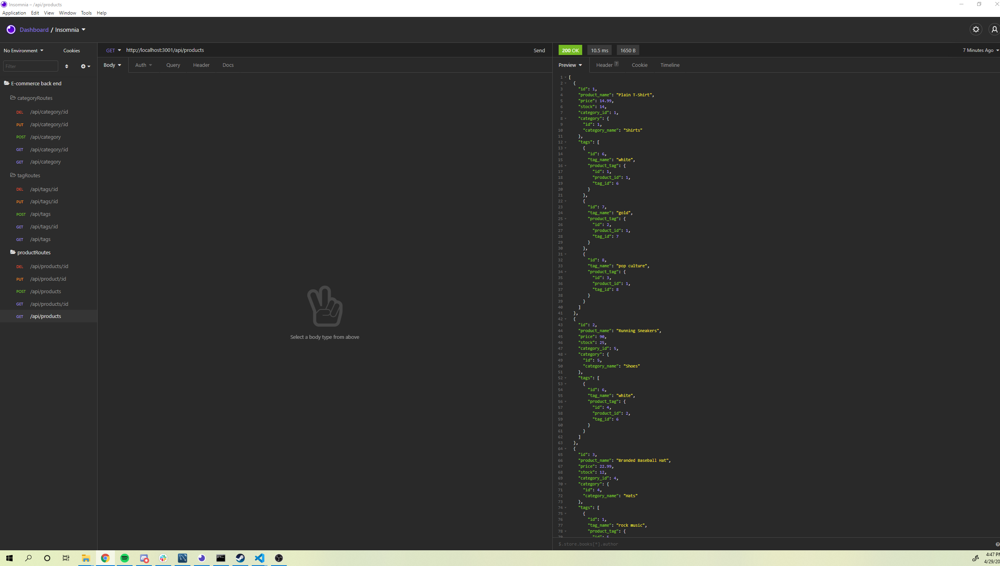

# E-commerceBackEnd

## Built with

-Sequeilize 

-MySql2

-Javascript

## Project Summary

A mock back end for a website which allows the user to create/delete/update tags and categories, and assign those tags and
categories to new products.

## Preview of project using Insomnia to make requests



## Code Snippet

An example of how a user could search for all items, vs search for a specific item by ID
```
router.get('/', async (req, res) => {
  // find all categories
  // be sure to include its associated Products
  try {
    const categoryData = await Category.findAll({
      include: [Product],
    });
    res.status(200).json(categoryData);
  } catch (err) {
    res.status(500).json(err);
  }
});

router.get('/:id', async (req, res) => {
  // find one category by its `id` value
  // be sure to include its associated Products
  try {
    const categoryData = await Category.findByPk(req.params.id, {
      include: [Product],
    });
    res.status(200).json(categoryData);
  } catch (err) {
    res.status(500).json(err);
  }
});
```

How all the different models were joined together
```
// Products belongsTo Category
Product.belongsTo(Category, {
  foreignKey: "category_id"

});

// Categories have many Products
Category.hasMany(Product, {
  foreignKey: "category_id"

});

// Products belongToMany Tags (through ProductTag)
Product.belongsToMany(Tag, {
  through: ProductTag,
  foreignKey: "product_id"
});

// Tags belongToMany Products (through ProductTag)

Tag.belongsToMany(Product, {
  through: ProductTag,
  foreignKey: "tag_id"
});
```

## My Links

[GitHub](https://github.com/SerenaChandler)

[repo](https://github.com/SerenaChandler/E-commerceBackEnd)

[demo](https://www.youtube.com/watch?v=9MRtR7mrOjk)